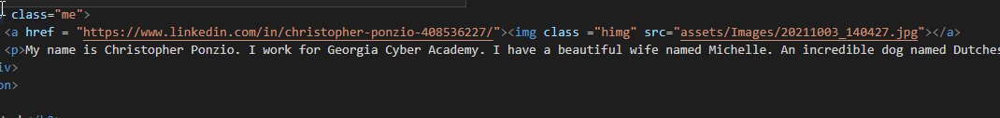

# Portfolio

## Description
Welcome to my Portfolio Readme. I have created this Portfolio to display the projects I have worked on for myself and parties interested in viewing my work. 

## Installation
https://christopherponzio.github.io/Portfolio
https://github.com/ChristopherPonzio/Portfolio

## Usage
This is an image of the code I used to imbed my Linkedin profile to my picture so that when you click on my picture it will take you to my Linkedin account!

## Credits
1. Michelle Blackwell github: https://github/Mblackwellgca
2. https://stackoverflow.com
3. https://w3schools.com
4. Photo by Vie Studio from Pexels
5. Photo by cottonbro from Pexels
6. Photo by pixabay from Pexels

## License
No License
